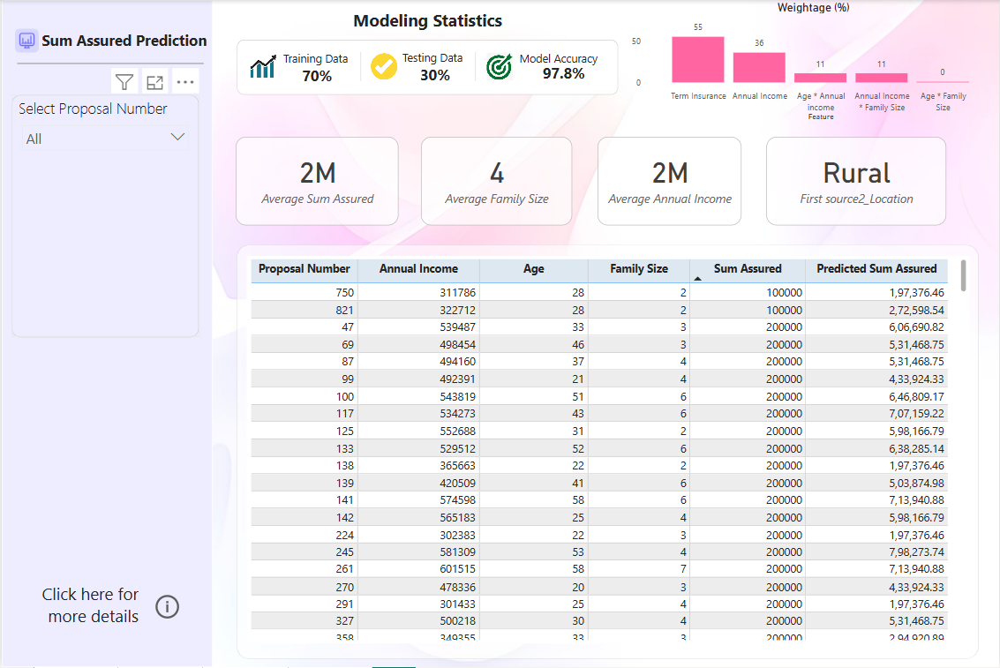
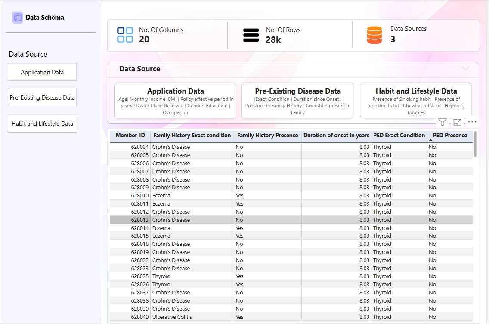
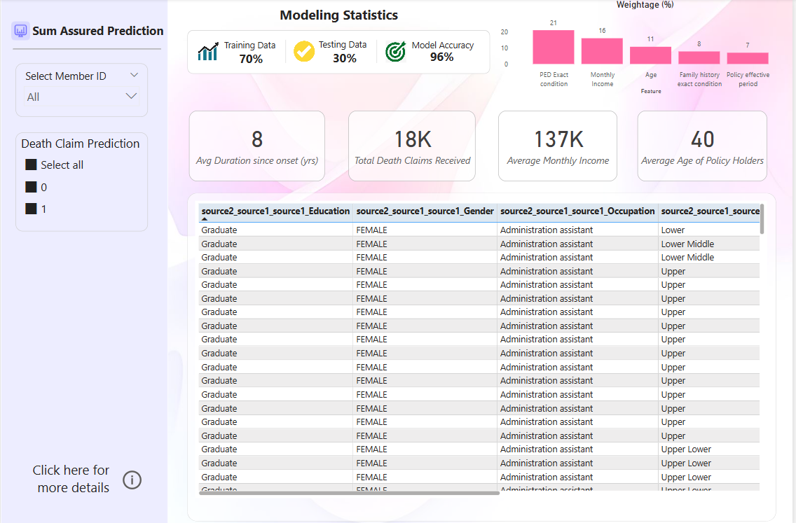
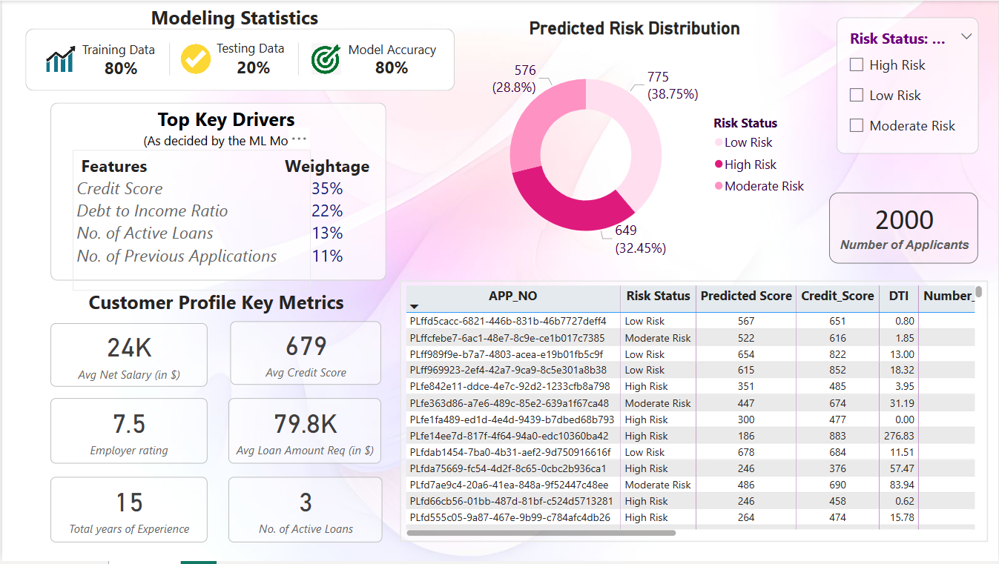

# 📊 Insurance Analytics Dashboards - Power BI

Welcome to a suite of interactive Power BI dashboards built for **real-world insurance analytics**. These dashboards explore **mortality risk**, **sum assured predictions**, and **agent retention metrics** through clean visuals and pre/post modeling insights.

---

## 📁 Dashboard Structure

| Folder/File | Description |
|-------------|-------------|
| `AR_PL.pbix` | Agent Retention & Performance Dashboard |
| `Sum Assured Model/` | Power BI models to predict sum assured (pre/post analysis) |
| `M0 Mortality Risk Prescreening Model/` | Dashboards for mortality risk prediction before and after ML application |
| `dashboard_images/` | Screenshots of key visuals for preview (used in README)

---

## 🧠 Project Highlights

- 📌 **Sum Assured Prediction Model**: Visualizes predicted vs. actual assurance values across customer segments  
- 📌 **Mortality Risk Dashboard**: Stratifies policyholders based on health risk indicators  
- 📌 **Agent Retention Analysis (AR_PL)**: Tracks sales, churn, and performance metrics

---

## 📸 Dashboard Previews

### 🧾 Sum Assured Model

### 🧠 Mortality Risk (Pre Model)

### 📈 Mortality Risk (Post Model)

### 👥 Agent Retention (AR_PL)

---

## 🛠 Tech Stack

- **Tool**: Microsoft Power BI
- **Data Sources**: CSV, Excel (company-specific structured data)
- **Visualization Techniques**: KPIs, trend analysis, conditional formatting, filters, slicers
- **Prediction Modeling Reference**: Risk flags and assurance scoring applied via external ML models

---

## 🚀 How to View

1. Download the `.pbix` files from the respective folders.
2. Open in **Power BI Desktop** (free from Microsoft).
3. Interact with slicers, charts, and metrics to explore trends.

> _Note: All data visualized is anonymized for demonstration._

---

## 📈 Use Case

This project is ideal for:
- **Insurance analytics teams**
- **Data storytelling portfolios**
- **Predictive risk modeling dashboards**
- **Demo showcase for BI internships or SDE applications**

---

## ✨ Author

**Kanishka Raisania**  
📧 kanishkaraisania@gmail.com  
🔗 [LinkedIn](https://www.linkedin.com/in/kanishka-raisania) | [Portfolio](https://kanishka-raisania.github.io/myportfolio.github.io/)

---

## 📜 License

Released under the [MIT License](LICENSE) for educational and portfolio use.
